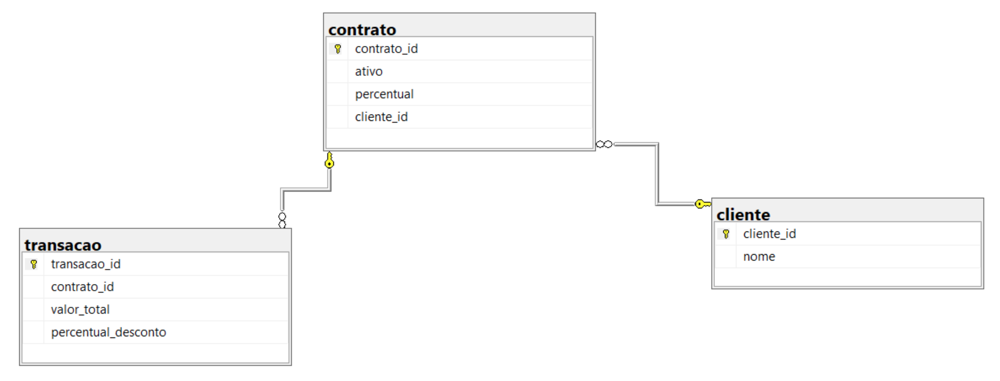
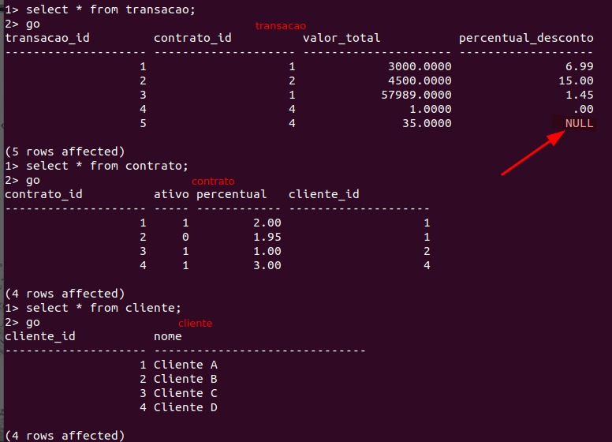
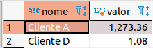

# Entregável 1

## Problema

Sua primeira tarefa consiste em escrever uma aplicação para calcular o ganho total da empresa, o qual é obtido a partir da taxa administrativa do serviço de cartão de crédito para seus clientes. Esse ganho é calculado sobre um percentual das transações de cartão de crédito realizadas por eles. O cálculo é baseado no conjunto de dados abaixo, transacao, contrato e cliente da <a href="https://drive.google.com/file/d/1lA2eLHNMoMpApPGz6h7WQpphT9URWxB1/view?usp=sharing">Figura 1</a>.

O resultado esperado é uma consulta que retorne o ganho total da empresa por cliente que é 1.198,77 para o cliente A e 1,08 para o cliente B, conforme a <a href="https://drive.google.com/file/d/1KJ9SvkcRX94YQDyKI01ivG-5N3lZp3T1/view?usp=sharing">Figura 2</a>.

Assim sendo, seguem <a href="https://drive.google.com/file/d/1lqZZb9WgkyyL7qBZ5ZAPENVYoioK2hMs/view?usp=sharing">snippet de código</a> para criação da base de dados e dos dados exemplos (via SQL Server).

## Solução

Visto que o SGDB da empresa consiste no MS SQLServer, fiz o pull da [imagem](https://hub.docker.com/_/microsoft-mssql-server) docker e rodei num contâiner para simular o databse.

```bash
# Fazendo o donwload da imagem docker
docker pull mcr.microsoft.com/mssql/server

# Rodando a imagem (obs.: o intuito desse tutorial é apenas resolver o problema, em um ambiente de produção nunca passe a senha sem estar encryptada ou armazenada em alguma variável de ambiente.)
sudo docker run -e "ACCEPT_EULA=Y" \
-e "MSSQL_SA_PASSWORD=senha@123" \
-p 1433:1433 --name sql1 --hostname sql1 \
-d mcr.microsoft.com/mssql/server:2022-latest
```

Agora com o database já em pé (verificar se o status do container está como 'up'), está na hora de popular o banco. Foi passado o script [aqui](https://drive.google.com/file/d/1lqZZb9WgkyyL7qBZ5ZAPENVYoioK2hMs/view?usp=sharing), porém para facilitar, copiei o conteúdo deste arquivo em outro chamado script.sql, que pode ser encontrado [aqui](src/script.sql).

Tendo o script em mãos e o banco em pé, está na hora de copiar o arquivo para dentro do contâiner, por isso vamos usar o comando:

```bash
# Copiando o arquivo para dentro do container
sudo docker cp src/script.sql <CONTAINER_ID>:/home
```

Com o arquivo no contâiner dentro do diretório _home_, podemos entrar no container e executá-lo.

```bash
sudo docker exec -it sql1 "bash"
```

Pronto! Entramos no contâiner, agora vamos entrar no SQLServer e executar o script ao mesmo tempo.

```bash
/opt/mssql-tools/bin/sqlcmd -S localhost \
-i /home/script.sql \
-U SA \
-P "<YourNewStrong@Passw0rd>"
```

Agora sim! Já populamos o database e entramos na linha de comando dele, agora podemos começar o desafio de verdade. Abaixo temos o diagrama do nosso database.




Ao se esperar de uma modelagem de um banco de dados relacional, temos as tabelas normalizadas. Para trabalhar com esses dados, vamos fazer utilizar a tabela _contrato_ como principal e fazer um join nas outras duas. Após isso, como queremos calcular o ganho total da empresa e visualizar por cliente, vamos usar os campos nome da tabela _cliente_, valor_total de _transacao_ e por último a coluna percentual da tabela _contrato_.

Antes de montar a query, vamos dar um `select *` nas tabelas para ver os dados já estruturados.



De cara já vemos um valor nulo na tabela _transacao_, vamos ter que tratar isso na hora de montar a query.

Bom, direto ao problema, precisamos encontrar o ganho total da empresa por cliente, então precisamos montar uma query que calcule o valor total (transacao.valor_total*contrato.percentual/100), agrupar por cliente e tratar o valor nulo encontrado.

(Obs.: Afim de testar e rodar as queries mais rápidas, conectei o [DBeaver](https://dbeaver.io/) no servidor local do SQLServer para executar as queries)

Sabendo dessas informações anteriores, utilizei a função `coalesce` para retornar 0 caso o valor da coluna percentual_desconto seja nulo. E para a lógica do valor final pensei:

aplicar o desconto na transação (multiplicar o valor_total pelo seu percentual, e como é desconto subtraíremos '-1' de seu valor), depois calcular o 'share' pra cada cliente usando o percentual do contrato. Então matematicamente ficaria:

$$\frac{(transacao.valor\_total * (1-transacao.percentual\_desconto))*contrato.percentual}{100}$$

A query ficou assim:

```sql
select cliente.nome, 
round(sum((contrato.percentual*(transacao.valor_total*(1-coalesce(transacao.percentual_desconto, 0)/100)))/100), 2) as valor
from desafio_engenheiro.dbo.contrato
join desafio_engenheiro.dbo.transacao
on transacao.contrato_id = contrato.contrato_id
join desafio_engenheiro.dbo.cliente
on cliente.cliente_id = contrato.cliente_id
group by cliente.nome
```

Executando a query, obtemos o seguinte resultado:



Portanto, chegamos no valor desejado :).