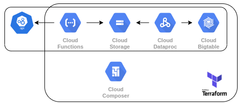

# Entregável 4

## Problema
Imagine que o Json das notas fiscais é disponibilizado em uma API. Como você utilizaria as tecnologias da GCP para ingerir, transformar e, eventualmente, carregar esses dados em um BigTable? O quarto entregável consiste na construção de uma arquitetura de ingestão dos dados de nota fiscal do entregável anterior (como visto <a href="https://www.crystalloids.com/hs-fs/hubfs/Screenshot%202022-02-04%20at%2009-44-40-png.png?width=1232&name=Screenshot%202022-02-04%20at%2009-44-40-png.png">aqui</a>), a qual deve atender aos seguintes pontos:

- Esquemas de fluxo de dados;
- Descrições de funcionamento (se necessário);
- Nomes de tecnologias em ecossistema GCP (serviços, conectores, bibliotecas e módulos).

Será apreciado como esforço extra se você conseguir avançar mais na aplicação além desse ponto.

Lembre-se que, como parte dos entregáveis anteriores, esperamos que alguns comentários sejam incluídos em suas soluções prévias; queremos entender melhor como foi seu processo de solução de problemas, quais as hipóteses levantadas e, se tivesse mais tempo, como você poderia melhorar a implementação proposta (desenvolvimento incremental).

## Solução

Utilizando somente recursos da plataforma GCP, criei esta solução com objetivo de ser um fluxo de ingestão batch, com consumo da API feita por [Cloud Functions (2nd Gen)](https://cloud.google.com/blog/products/serverless/cloud-functions-2nd-generation-now-generally-available), uma etapa de staging pelo [Storage](https://cloud.google.com/storage/), transformação dos dados utilizando o [Dataproc](https://cloud.google.com/dataproc) e escrevendo no [BigTable](https://cloud.google.com/bigtable). E para orquestrar tudo isso, utilizaremos o [Composer](https://cloud.google.com/composer) (Airflow) com a arquitetura toda provisionada pelo [Terraform](https://www.terraform.io/).

Já com o diagrama da arquitetura em mente, vou justificar cada escolha de tecnologia nos próximos tópicos.

## Cloud Functions

Eu escolhi as cloud functions por ser uma forma serverless e barata para fazer chamadas de requisições na API e escrever os dados no storage, e a segunda geração delas nos possibilita um poder maior de processamento e memória com timeout de até 1 hora, flexibilizando o uso dela. Caso a API que consultaremos não tenha uma biblioteca própria, utilizaremos a biblioteca Requests do Python junto com a google-cloud-storage para escrever os dados no bucket.

## Cloud Storage

Por suportar qualquer tipo de formato de arquivo, barata, e de fácil acesso via APIs nativas, o Cloud Storage foi escolhido pra ser o intermediário de armazenamento da pipeline, onde a Cloud Function escreverá os dados no formato Newline Delimited JSON.

## Dataproc

Mais especificamente, o (Dataproc Serverless)[https://cloud.google.com/dataproc-serverless/docs/overview] foi escolhido por ser uma forma _serverless_, então podemos rodar o Spark sem um servidor por trás, então não precisaremos nos preocupar em hostear nada, mais barata que o comum e também o próprio google oferece um template [GCStoBigTable](https://github.com/GoogleCloudPlatform/dataproc-templates/tree/main/python/dataproc_templates/gcs#gcs-to-bigtable) o qual poderemos usar como base.

## Composer

Por ser um serviço de orquestração de fluxos de trabalho totalmente gerenciado e criado no Apache Airflow, temos toda a dinamicidade e flexibilidade desse software livre com dezenas de bibliotecas credenciadas que podem nos auxiliar nesse fluxo de trabalho, como a própria bilbioteca do Dataproc pro Airflow, que contém um [operador](https://airflow.apache.org/docs/apache-airflow-providers-google/stable/operators/cloud/dataproc.html#create-a-batch) nativo para rodar nossos batches (Dataproc Serverless).

## Terraform

O Terraform é uma ferramenta de software de infraestrutura mais populares atualmente, e por possuir o Google como um provedor oficial de seus módulos, ele é a melhor opção para gerenciar todos esses recursos criados.

## Roadmap

Criar um sistema de monitoria e alertas para o pipeline utilizando o Grafana, Stackdriver e Logging.